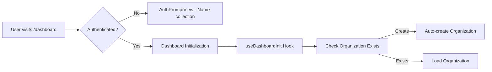

# Chayo Business Flow Analysis
## Complete System Architecture from Onboarding to Business Operations

> **Generated on:** January 31, 2025  
> **Purpose:** Comprehensive analysis of the entire business flow before making further changes

---

## 🎯 Executive Summary

Chayo operates on a **two-phase system**:
1. **Onboarding Phase** - Dynamic question-based setup using AI-generated questions
2. **Business Operations Phase** - Ongoing business assistance and information collection

The system intelligently transitions between these phases based on completion status and continues to evolve the business knowledge base even after onboarding.

---

## 📊 System Architecture Overview

### Core Components

| Component | Purpose | Key Files |
|-----------|---------|-----------|
| **Dashboard** | Main UI entry point | `app/[locale]/dashboard/page.tsx` |
| **Organization Chat Service** | Central chat orchestration | `lib/features/chat/services/organizationChatService.ts` |
| **Onboarding Service** | Manages setup completion | `lib/features/onboarding/services/integratedOnboardingService.ts` |
| **Business Info Service** | Stores/retrieves business data | `lib/features/organizations/services/businessInfoService.ts` |
| **Setup Completion Service** | Tracks progress | `lib/features/onboarding/services/setupCompletionService.ts` |

### Database Tables

| Table | Purpose | Key Fields |
|-------|---------|------------|
| `organizations` | Business entities | `id`, `name`, `slug`, `owner_id` |
| `business_info_fields` | Question/answer storage | `field_name`, `field_value`, `is_answered`, `stage` |
| `setup_completion` | Progress tracking | `setup_status`, `current_stage`, `answered_questions` |
| `conversations` | Chat history for RAG | `user_message`, `ai_response`, `metadata` |

---

## 🔄 Complete User Flow

### Phase 1: Initial Setup & Authentication



### Phase 2: Onboarding State Determination

The system uses `organizationChatService.determineOnboardingState()` to classify organizations into three states:

#### State Logic
```typescript
// NOT_STARTED: No setup_completion record exists
// PROCESSING: setup_completion exists but setup_status != 'completed'  
// COMPLETED: setup_status === 'completed'
```

#### State Handlers
- **NOT_STARTED** → `handleNotStarted()` - First interaction, welcome message
- **PROCESSING** → `handleInProgress()` - Active onboarding with dynamic questions
- **COMPLETED** → `handleCompleted()` - Business operations mode

### Phase 3: Dynamic Question System

#### Onboarding Questions (PROCESSING State)
1. **AI-Generated Questions** - No hardcoded questions, all generated contextually
2. **Three-Stage Structure** - `stage_1`, `stage_2`, `stage_3` (Core → Industry → Branding)
3. **Progressive Disclosure** - One question at a time, stored in `business_info_fields`
4. **Completion Detection** - AI emits `STATUS: setup_complete` signal

#### Business Questions (COMPLETED State)  
1. **Continuous Learning** - System generates new questions even after onboarding
2. **Context-Aware** - Based on previous conversations and business data
3. **On-Demand** - Questions generated as needed, not pre-defined

---

## 🧠 AI System Prompts & Decision Making

### Prompt Selection Logic
```typescript
// In organizationChatService.generateAndStoreAIResponse()
const promptType = (type === 'business') ? 'business' : 'onboarding'
const isSetupCompleted = (promptType === 'business') ? true : false
const systemPrompt = await YamlPromptLoader.buildSystemPrompt(locale, trainingContext, isSetupCompleted, currentStage)
```

### System Prompt Files
- **Onboarding**: `onboardingSystemPrompt.yaml` - Guides setup questions
- **Business**: `businessSystemPrompt.yaml` - Handles ongoing operations
- **Formatting**: `multipleChoiceFormatting.ts` - JSON structure rules

### AI Response Processing
```typescript
// Enhanced JSON parsing (our recent fix)
1. Extract conversational text before JSON
2. Parse JSON structure for structured questions  
3. Store business questions in database
4. Return UI-ready format with multipleChoices array
```

---

## 💾 Data Flow & Storage

### Onboarding Data Flow
```
User Input → AI Processing → Question Generation → business_info_fields table
                           ↓
Question Response → Validation → Mark as Answered → Update setup_completion
                                                  ↓
Check Completion → STATUS: setup_complete → Mark as COMPLETED
```

### Business Operations Data Flow
```
User Input → Check Pending Questions → Return Existing OR Generate New
                                     ↓
Question Response → Store in business_info_fields → Continue Business Chat
                                                   ↓
All Conversations → Store in conversations table → Used for RAG/context
```

### Question Storage Structure
```typescript
interface BusinessInfoField {
  field_name: string        // snake_case identifier
  field_value: string       // user's answer
  field_type: 'text' | 'multiple_choice'
  question_template: string // the question asked
  multiple_choices?: string[] // options for MC questions
  is_answered: boolean      // completion status
  stage: string            // stage_1, stage_2, stage_3
}
```

---

## 🔄 Mode Transition Logic

### Onboarding → Business Transition
```typescript
// Triggered by AI response containing completion signal
if (aiResponse.includes('STATUS: setup_complete')) {
  await setupCompletionService.markAsCompleted(organizationId)
  // Future chat requests will use handleCompleted() method
}
```

### Business Mode Behavior
- **Intelligent Question Management** - Checks for pending business questions first
- **Conversational Fallback** - If no pending questions, provides general business assistance
- **Continuous Learning** - Can generate new questions based on conversation context
- **Context-Aware Responses** - Uses collected business data in system prompts

---

## 🎨 UI Components & State Management

### Dashboard State Management
```typescript
// Key hooks managing the flow
useAuth()                    // Authentication state
useDashboardInit()          // Dashboard initialization  
useOnboardingProgress()     // Onboarding progress tracking
useBusinessModeChat()       // Business chat functionality
useChat()                   // Core chat mechanics
```

### Component Hierarchy
```
DashboardContent
├── AuthPromptView (unauthenticated)
├── LoadingScreen (loading states)
├── MainDashboardLayout (authenticated)
    ├── ChatContainer
        ├── BusinessChatView (main chat)
            ├── ChatMessages
                ├── ChatMessage (regular)
                ├── ChatMessageWithMultipleChoice (structured)
                    └── MultipleChoice (options + "Other")
```

### State Synchronization
- **Real-time Progress** - `useOnboardingProgress` polls `/api/onboarding-status`
- **Chat State** - `useChat` manages messages and API calls to `/api/organization-chat`
- **Business Mode** - `useBusinessModeChat` handles onboarding completion detection

---

## 🔌 API Endpoints

### Core Chat API
- **`/api/organization-chat`** - Main chat processing endpoint
  - Calls `organizationChatService.processChat()`
  - Returns `{ aiMessage, multipleChoices, allowMultiple }`

### Supporting APIs
- **`/api/onboarding-status`** - Progress polling for UI
- **`/api/setup`** - Initial organization setup
- **`/api/upload`** - File uploads for business context

---

## 🚨 Critical Decision Points

### 1. Question Generation Strategy
**Current**: Dynamic AI-generated questions based on conversation context
**Benefits**: Flexible, contextual, no hardcoded limitations
**Risks**: Unpredictable, requires robust parsing

### 2. State Determination Logic
**Current**: Database-driven state based on `setup_completion.setup_status`
**Benefits**: Clear separation, resumable progress
**Risks**: Complexity in state management

### 3. Multiple Choice Handling
**Current**: AI generates options, UI always adds "Other" option
**Benefits**: Flexible for users, consistent UX
**Recent Fix**: Removed duplicate "Other" options, simplified logic

### 4. Business Mode Continuation
**Current**: Can generate new business questions indefinitely
**Benefits**: Continuous business knowledge growth
**Risks**: Potentially overwhelming for users

---

## 📈 Current System Strengths

✅ **Flexible Question System** - Dynamic, context-aware question generation  
✅ **Clear State Management** - Well-defined phases with proper transitions  
✅ **Robust Data Storage** - Structured storage with proper relationships  
✅ **Internationalization** - Multi-language support throughout  
✅ **Type Safety** - Strong TypeScript usage across components  
✅ **Modular Architecture** - Clean separation of concerns  

---

## ⚠️ Identified Areas for Improvement

### 1. Question Overload Risk
**Issue**: System can generate unlimited questions in business mode
**Impact**: May overwhelm users who just want to use the system
**Recommendation**: Add question throttling or "sufficient info" detection

### 2. Setup Completion Ambiguity  
**Issue**: AI determines completion, not always predictable
**Impact**: Users might get stuck in onboarding
**Recommendation**: Add manual completion option or clearer completion criteria

### 3. Business Data Utilization
**Issue**: Collected business info usage could be more explicit
**Impact**: Users may not see value in providing detailed information
**Recommendation**: Show how business data improves responses

### 4. Error Recovery
**Issue**: Limited error recovery for failed state transitions
**Impact**: Users could get stuck in broken states
**Recommendation**: Add state reset capabilities and better error handling

---

## 🎯 Recommended Next Steps

### Priority 1: User Experience
1. **Question Fatigue Prevention** - Implement intelligent stopping criteria
2. **Progress Transparency** - Show users how their data is being used
3. **Manual Controls** - Allow users to skip/complete sections manually

### Priority 2: System Robustness  
1. **Error Recovery** - Add state reset and recovery mechanisms
2. **Performance Optimization** - Cache frequently accessed business data
3. **Testing Coverage** - Add comprehensive integration tests for state transitions

### Priority 3: Business Value
1. **Data Utilization Display** - Show users how their info improves responses
2. **Export Capabilities** - Allow users to export their business profile
3. **Integration Preparation** - Structure data for easy third-party integrations

---

## 📋 System Health Metrics

### Key Metrics to Monitor
- **Onboarding Completion Rate** - % of users who complete setup
- **Average Questions Asked** - How many questions users answer
- **State Transition Success** - % of successful onboarding→business transitions
- **Business Mode Engagement** - Usage after onboarding completion
- **Question Response Rate** - % of generated questions that get answered

### Current State Assessment
✅ **System is functional and processes requests correctly**  
✅ **State transitions work as designed**  
✅ **Data storage is consistent and reliable**  
⚠️ **User experience could be optimized for question fatigue**  
⚠️ **Error recovery mechanisms need strengthening**  

---

*This analysis provides a complete picture of the current system architecture and serves as a foundation for making informed decisions about future changes.*