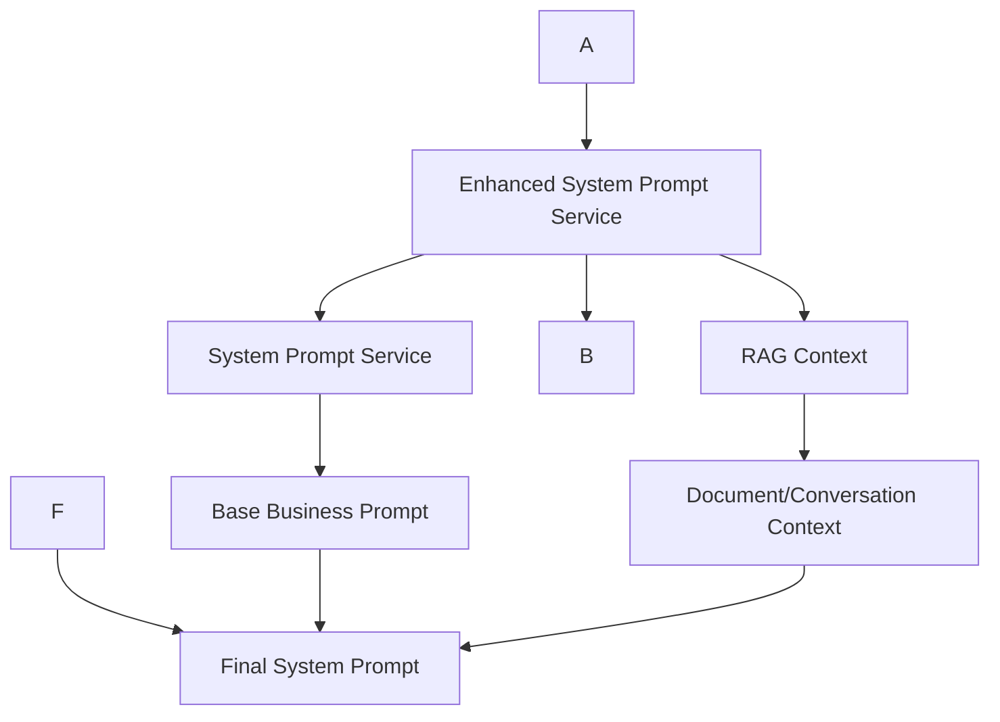

# System Prompt Architecture

This document explains the refactored system prompt generation architecture that separates concerns for better maintainability and developer understanding.

> **Before vs After**: The system prompt logic was previously scattered across a single large function. Now it's cleanly separated into focused services with clear responsibilities.

## 🏗️ Architecture Overview

The system prompt generation has been split into focused, single-responsibility services:



## 📁 Services

### 2. `EnhancedSystemPromptService`
**Purpose**: Orchestrates complete system prompt generation
**Location**: `lib/services/enhancedSystemPromptService.ts`

```typescript
const enhancedService = new EnhancedSystemPromptService(supabase)
const result = await enhancedService.generateEnhancedPrompt(agentId, messages, userQuery, locale)

// Returns: { finalPrompt, metadata }
```

**Responsibilities**:
- ✅ Coordinates between base prompt and training hints
- ✅ Combines all prompt components
- ✅ Provides detailed metadata for debugging
- ✅ Handles fallback scenarios
- ✅ Logs generation details

### 3. `SystemPromptService` (Existing)
**Purpose**: Generates base business system prompts with RAG
**Location**: `lib/services/systemPromptService.ts`

**Responsibilities**:
- ✅ RAG document retrieval
- ✅ Business constraint integration
- ✅ Base prompt generation
- ✅ Conversation context

## 🔄 Data Flow

### 1. **Training Hint Selection** (UI)
```typescript
// ChatContainer.tsx
const handleTrainingHintSelect = async (hint) => {
  // Use service to create standardized message
  const message = TrainingHintService.createFocusMessage(hint)
  setMessages([...messages, systemMessage])
  handleSend() // Trigger AI response
}
```

### 2. **System Prompt Generation** (Backend)
```typescript
// chatService.ts
const enhancedService = new EnhancedSystemPromptService(supabase)
const result = await enhancedService.generateEnhancedPrompt(
  agentId, 
  messages, 
  userQuery, 
  locale
)

## 🎯 Benefits

### **For Developers**:
- **🧩 Single Responsibility**: Each service has one clear purpose
- **🔍 Easy Debugging**: Clear separation makes issues easier to trace
- **🧪 Better Testing**: Services can be tested independently
- **📖 Self-Documenting**: Service names and methods explain their purpose

### **For Maintainability**:
- **🔄 Reusable Logic**: Training hint logic used across components
- **⚡ Performance**: Services only do what they need to
- **🛡️ Error Handling**: Isolated fallbacks for each component
- **📊 Observability**: Rich metadata for monitoring

## 🚀 Usage Examples

### Adding a New Training Hint Type
```typescript
// 1. Update TrainingHintService with new hint logic
// 2. No changes needed in ChatContainer or chatService
// 3. Enhanced service automatically handles new hints
```

### Debugging System Prompt Issues
```typescript
// Check the detailed metadata from EnhancedSystemPromptService
console.log(result.metadata)
// {
//   basePromptLength: 2041,
//   trainingHintContext: { hint: {...}, hasActiveHint: true },
//   hasDocumentContext: true,
//   systemPromptLength: 2847
// }
```

### Testing Individual Components
```typescript


## 🏷️ Key Interfaces


interface SystemPromptResult {
  finalPrompt: string
  metadata: {
    basePromptLength: number
    hasDocumentContext: boolean
    hasConversationContext: boolean
    systemPromptLength: number
  }
}
```

This architecture makes the system prompt generation much more maintainable and easier for developers to understand and modify. 